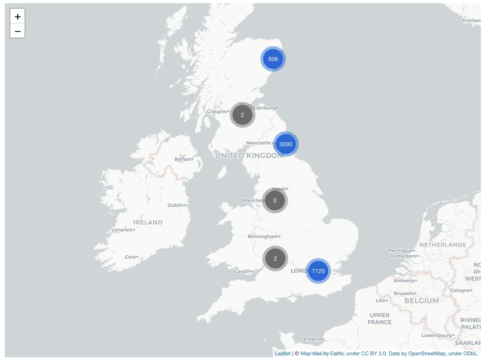
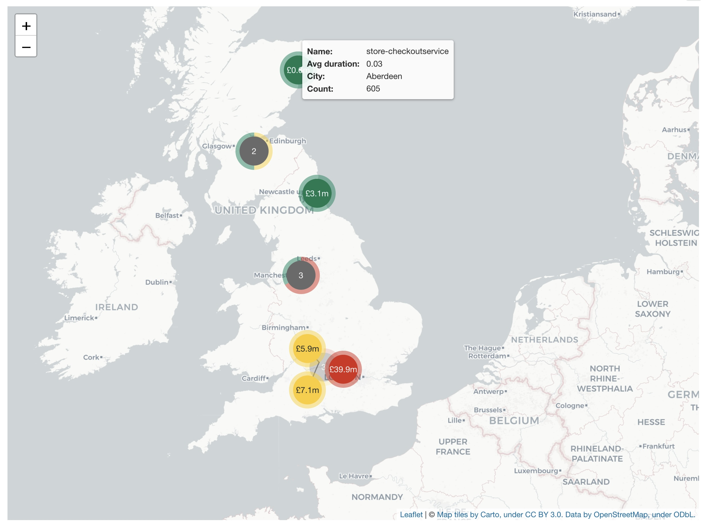
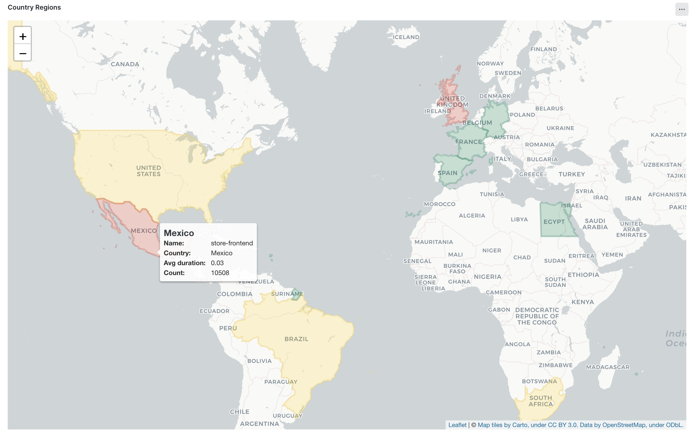
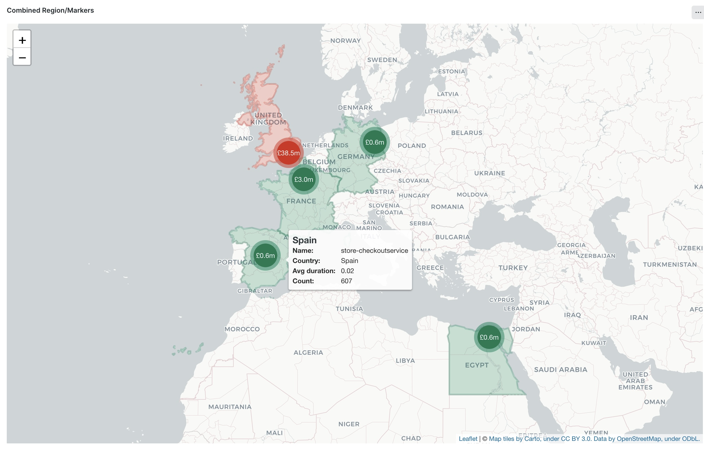
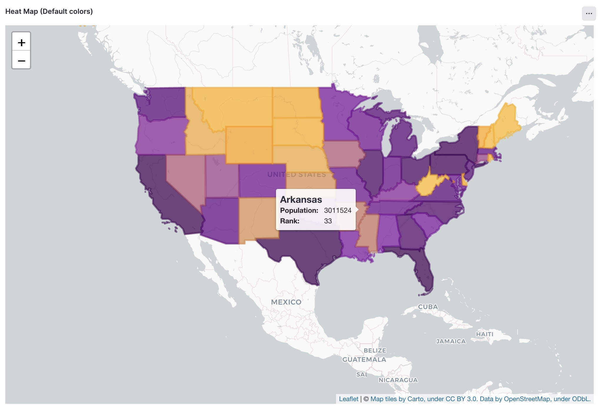
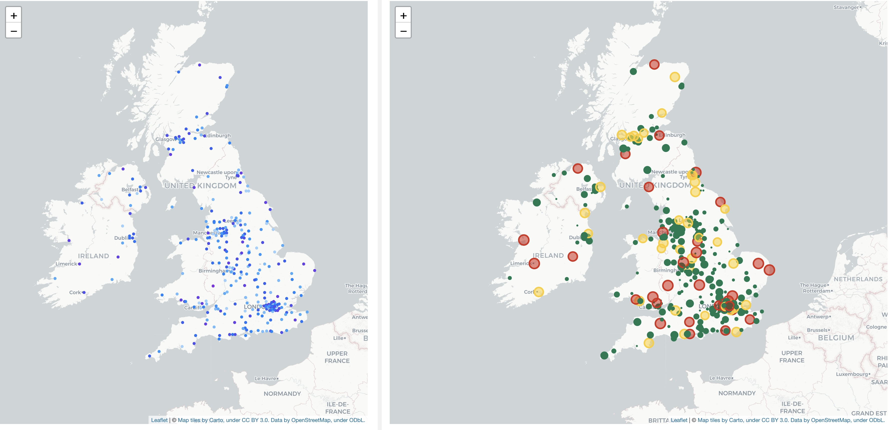
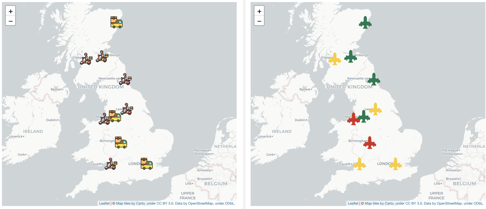
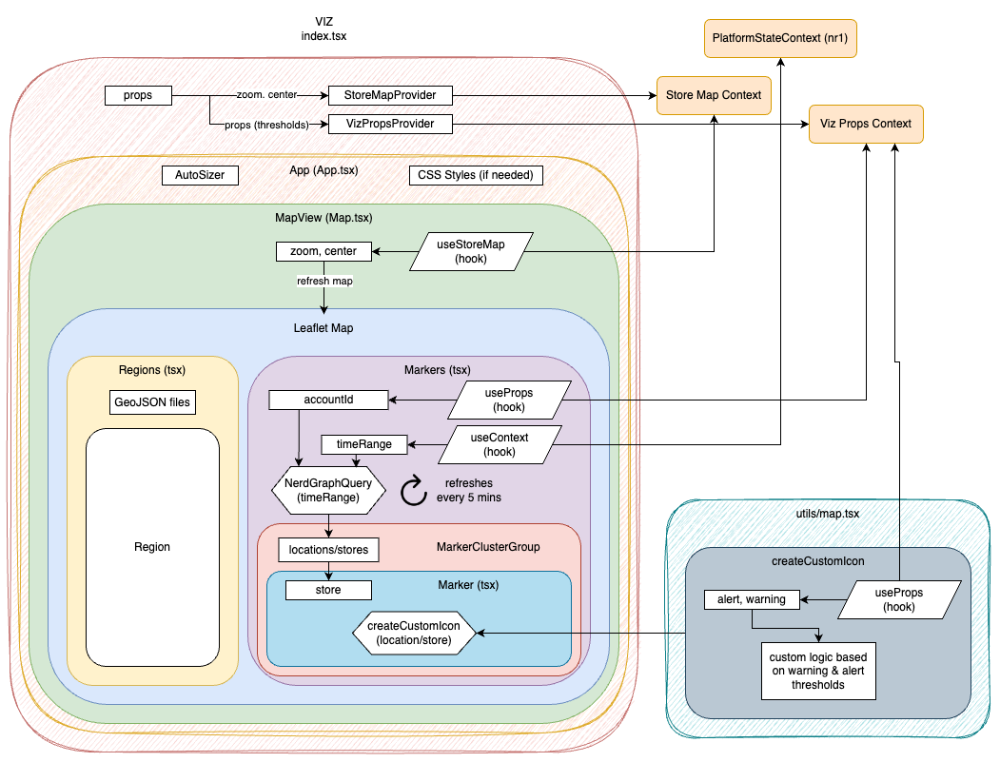

<a href="https://opensource.newrelic.com/oss-category/#new-relic-experimental"><picture><source media="(prefers-color-scheme: dark)" srcset="https://github.com/newrelic/opensource-website/raw/main/src/images/categories/dark/Experimental.png"><source media="(prefers-color-scheme: light)" srcset="https://github.com/newrelic/opensource-website/raw/main/src/images/categories/Experimental.png"></picture></a>

# Geo Location Map Visualization

Geo Location Map Visualization is a dynamic web application designed to visually represent business or telemetry data on a geographical map. This tool is particularly useful for businesses seeking to data across different physical locations. It utilizes New Relic's custom visualization capabilities, alongside React and Leaflet, to provide a user-friendly and interactive map interface.









## Features

- **Dynamic Data Visualization:** Visualize data from different locations on an interactive map. Display key metric and and hover to reveal more.
- **Customizable Thresholds:** Set custom thresholds for key indicator. Markers change color based on thresholds providing and intuitive visual representation of each locations status.
- **Interactive Map Clusters:** Locations are clustered on the map for a cleaner visual representation. Clicking on a cluster zooms into that area, revealing individual markers. Clusters also provide a summary representation of the underlying marker status.
- **Real-time Data Updates:** The application periodically fetches and updates data, ensuring the information displayed is current and accurate.
- **Flexible Configuration:** Easily configure via configuration options and query values.
- **Country Regions:** Display whole countries with threshold colourings.
- **Regional Heatmaps:** Dynamicaly shade regions to generate heat maps based on value.
- **High density mode:** Render dense locations with smaller markers, including status and heatmap
- **Customizable icons:** Use PNG or SVG iconography

## Prerequisites

Before we start, make sure you have the following installed:

1. [Node.js](https://nodejs.org/) (>=12.13.0).
2. [New Relic CLI](https://one.newrelic.com/launcher/developer-center.launcher) (>=0.25.0).

Also, make sure you are logged in to your New Relic account. (alternatively check out the [Set up your development environment guide](https://developer.newrelic.com/build-apps/set-up-dev-env/)).

## Installation

Clone the repository and run `npm install` to install dependencies.

You will need a development profile, you can read more about how to set up on the New Relic [developer site](https://developer.newrelic.com/)

To summarise the steps required:

- Navigate to the "Build your own Nerdpack" tile under `+Add data > Apps and visualizations`
- Follow steps one to three to download and install the NR1 CLI, generate API key and add the key to your profile (`nr1 profiles:add --name {account-slug} --api-key {api-key} --region {us|eu} `)
- Ensure the correct profile is selected: `nr1 profiles:default`
- Generate a new UUID for your app deployment: `nr1 nerdpack:uuid -gf`

## Testing

You can test locally by running `nr1 nerdpack:serve`

## Deploy to account

To use the custom visualisation you must deploy it to your account following these steps:

- Ensure the correct profile is selected: `nr1 profiles:default`
- Publish the assets: `nr1 nerdpack:publish`
- Deploy to production: `nr1 nerdpack:deploy`
- Subscribe your account: `nr1 subscription:set`

The custom visualization should now appear as an option in the Custom Visualizations app (in the Apps > Custom Visualizations). Select the custom visualization, configure it and save to a dashboard.

Pro tip: Once a custom visualization is on a dashboard, you can click the ellipses to duplicate it.

## Configuration

The visualization is highly configurable, allowing users to tailor its behavior and appearance to their specific needs. Configuration is managed primarily managed through config options and by providing data in an NRQL query.

You may also change color schemes etc by editing the values in the `constants.ts` file, this will affect all instances of the visualization.

### Configuration Options

The following options can be configured using the visualization configuration panel:

- **Account ID:** Choose the account you wish the query to work against. (The custom visualization needs to be deplopyed to all accounts that you require data from.)
- **Markers query:** This is an NRQL query that returns the markers to render on the map. You must supply a longitude and latitude value for each location, along with the data to render. See below for more details on the query structure.
- **Markers colors**: Allows you to override the colours used for markers states. Specify hex colors in a comma seperated list in the order: cluster,no-status,ok,warning,critical. If using the heatmnap feature then supply here a list of comma seperated of hex color stops.
- **Marker heatmap steps:** This is the number of color steps to use in marker heatmap gradient. If ommitted or zero heatmap is disabled.
- **Regions query:** This is an NRQL query that returns the regions to render on the map. You must supply a valid region field. See below for more details on the query structure.
- **Region heatmap steps:** This is the number of color steps to use in regions heatmap gradient. If ommitted or zero heatmap is disabled.
- **Default Since/Until:** The since.until clause to use when no picker value (i.e. default) is selected.
- **Ignore time picker:** If checked changes to the time picker will not be applied to the maerk query.
- **Default zoom:** This allows you to select how zoomed in the map is when it first loads.
- **Disable cluster at zoom:** You can choose at what zoom level the clustering is disabled and all markers shown. This deafults to level 7.
- **Center lat,lng:** Specify the center of the map as two lat/lng coordinates. e.g. "51.5,0.1"
- **Fetch interval:** The number of seconds between refresh. Default is 5 minutes if empty. Specify 0 to disable auto refresh.

### Markers Query

For the most flexibility, you can provide a number of configuration and data values via the NRQL query as named fields. If supplied, the fields perform the following actions:

- **`SINCE` / `UNTIL`:** If your query includes a since or until clause then the time picker will be ignored.
- **`latitude` & `longitude`:** These values are required, and indicate the location on the map.
- **`value`:** This field should contain the key value you want to display, it is the value that the thresholds to indicate status are compared with. Note: If you are selecting a value that is affected by changes to the time window (such as a `count()`) you may consider wrapping in a `rate()` function so that the thresholds specificed continue to work over different time ranges. e.g. `...rate(count(*), 1 minute) as 'value'`
- **`threshold_critical` & `threshold_warning`:** Specify one or both of these values to determine the marker status color. As with standard billboard widgets, if the critical threshold is larger than warning threshold then the status will be determined by the `>=` operator. Conversely if the warning threshold is larger than the critical then the status is determined by the `<=` operator (comparisons are made against the `value` field).
- **`icon_label`:** If this field is provided then it will be used to display on the marker. This is useful for displaying a different value than that which you are setting the status colour from.
- **`link`:** A URL. If present then clicking on a marker will take the user to the URL provided. You can use this to link to other New Relic pages or your own systems.
- **`tooltip_label_of_your_choice`:** The tooltip that appears when you hover over a marker can display as many values as you require. Simply provide as many 'tooltip*' fields as you require. The label will be automatically created from the text after the "tooltip*" string. Pro tip: Prefix your tooltip label to affect sorting. e.g. "atooltip_zoo_name" will appear above "ztooltip_aardvark" in the tool tip.
- **`icon_radius`:** If present this triggers **high denisty mode** where markers are drawn as small circles and clustering is disabled. Specify the radius in pixels. (Takes precedence over other marker types)
- **`icon_url`**: If present then an icon is displayed instead of the circular marker. Provide a valid http URL for the image.
- **`icon_svg`**: Allows an SVG path(s) to be provided. This allows for custom icons that can be colored using the status or heatmap features. Specify the XML for paths as a string. e.g: `'<path d="xxx xxx xxx"><path d="yyy yyy yyy">' as icon_svg` (see https://icons.getbootstrap.com/ for inspiration)
- **`icon_size`**: Allows you to sepcify the size of the icon in pixels (for url and SVG only). This can be dynamic allowing for icons to be displayed at different sizes based upon the data.

### Regions Query

Regions can be rendered as an alternative or in additon to markers. Use the same configuration opttions as above with following changes:

- **`geoISOCountry`:** The ISO A3 or ISO A2 country code (e.g. "GBR" or "GB") (Replaces latitide/longitude)
- **`geoUSState`:** A US state 2 letter code, number or name
- **`geoUKRegion`:** A Uk Region name
- **`tooltip_header`**: By default the country name is displayed as tool tip header. You can override by supplying a value here. Specify empty string or NONE to remove the header entirely.
- **`custom_color`:** Provide a hex color code for this region (overrides all other colors)

More details regarding region setup can be found [here](./visualizations/store-map-viz/geo/readme.md).

#### Precision, prefix and suffix

Its possible to specify the precision of numbers and add prefix/suffix to values. These adjustments can be made to the `icon_label` and `tooltip_xxx` fields by providing extra fields:

- **`_precision`:** Sets the number of decimal places to display. e.g. `select ... 2 as 'icon_label_precision'...`
- **`_prefix`:** Adds a prefix to the value. e.g. `select ... '$' as 'tooltip_sales_prefix' ...`
- **`_suffix`:** Adds a suffix to the value. e.g. `select ... 'rpm' as 'tooltip_thoughput_suffix' ...`

You may also override the default precision (2) of the icon value by setting `value_precision` if you are not providing an icon label.

#### Example Query

Here is a basic example query, that utilises a lookup table (containing storeID/lat/lng/city) to supply the latitude, longitude to the data:

```
FROM Transaction left join (from lookup(geoCities) select storeId, city as city, lat, lng limit max) on storeId
select rate(count(*), 1 hour) as value,
latest(lat) as latitude,
latest(lng) as longitude
facet city as name limit max
```

Here is a more complex query that demonstrates additional features as described above:

```
FROM Transaction left join (from lookup(geoCities)
select storeId,city as city,lat,lng limit max) on storeId
select

rate(count(*), 1 hour) as value,
10000 as threshold_critical,
5000 as threshold_warning,

latest(lat) as latitude,
latest(lng) as longitude,

rate(count(*)/1000,1 hour) as icon_label,
1 as 'icon_label_precision',
'£' as icon_label_prefix,
'm' as icon_label_suffix,

'https://www.newrelic.com' as link,

count(*) as 'tooltip_count',

latest(city) as 'tooltip_city',

average(duration) as 'tooltip_avg_duration',
2 as 'tooltip_avg_duration_precision'

facet city as 'name' limit max
```

## Geo Regions

The Geo regions are defined in [countries.geojson.json](./visualizations/store-map-viz/geo/countries.geojson.json). This is a GEOJSON file contiaing the country region polygons. You may want to edit these to suit your needs.

## Architecture

The following diagram illustrates the architecture of the visualization:



## Support

New Relic hosts and moderates an online forum where customers can interact with New Relic employees as well as other customers to get help and share best practices.

## Contributing

We encourage your contributions to improve Store Map Visualisation! Keep in mind when you submit your pull request, you'll need to sign the CLA via the click-through using CLA-Assistant. You only have to sign the CLA one time per project.
If you have any questions, or to execute our corporate CLA, required if your contribution is on behalf of a company, please drop us an email at opensource@newrelic.com.

**A note about vulnerabilities**

As noted in our [security policy](https://github.com/newrelic-experimental/newrelic-store-map-visualisation/security/policy), New Relic is committed to the privacy and security of our customers and their data. We believe that providing coordinated disclosure by security researchers and engaging with the security community are important means to achieve our security goals.

If you believe you have found a security vulnerability in this project or any of New Relic's products or websites, we welcome and greatly appreciate you reporting it to New Relic through [HackerOne](https://hackerone.com/newrelic).

## License

New Relic Store Map Visualisation is licensed under the [Apache 2.0](http://apache.org/licenses/LICENSE-2.0.txt) License.
